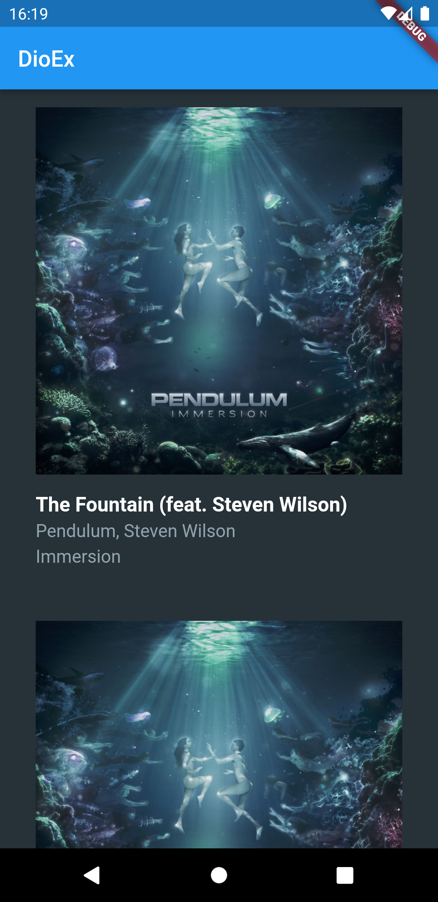

# dio_ex
dioのパッケージを利用してSpotify APIを叩き、自分のプレイリストのアイテムを取得・表示する

## How to Build
- ビルドする場合、Spotify Developerサイトでアプリを作成し、取得したClient IDとClient SecretをApiClientクラスの定数に設定してください。
    - Spotify for Developer
        - https://developer.spotify.com/dashboard/

## Screenshot

https://user-images.githubusercontent.com/9344579/193874351-f04b0ffd-2f34-4ee5-92af-b4caf2302e22.mp4

