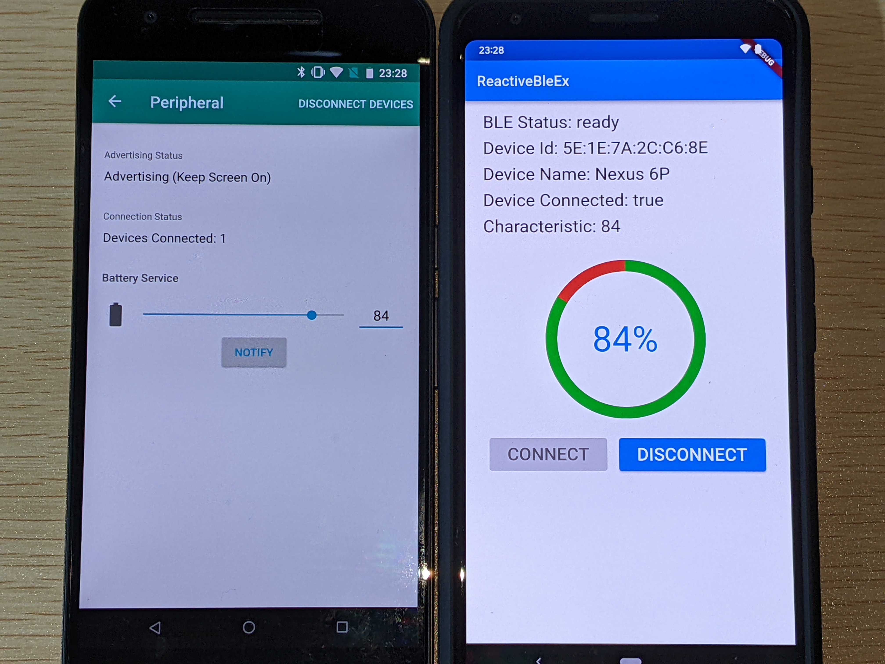

# reactive_ble_ex
Bluetooth Low Energy (BLE) モジュールと通信をする処理を作成する

## 簡単な解説
- シミュレーターを入れてBLEデバイス化したAndroid端末（Battery Service）とBLE通信しバッテリー残量を受信する処理を作成する

- BLE端末
    - Peripheral（上画像の左側）
        - BLE Peripheral Simulatorを入れてBattery ServiceのBLEデバイスにしている
        - **NOTIFI**をタップすると接続しているCentralにバッテリーレベルを通知
    - Central（上画像の右側）
        - Battery Serviceから受信したバッテリーレベルを表示
        - **CONNECT**ボタン
            - Battery ServiceのBLEデバイスを検索して接続
        - **DISCONNECT**ボタン
            - 接続中のBLEデバイスを切断

## 利用パッケージ
- flutter_reactive_ble: ^5.0.2
    - BLE通信を行うライブラリ

## Central側の実行イメージ
- 下の順で収録
    - Battery Serviceを検索して接続。接続時にバッテリーレベルを読み取り
    - Battery Serviceから変更通知を受信
    - 接続中のBattery Serviceを切断
    
https://user-images.githubusercontent.com/9344579/185644347-069e978e-bfa1-4676-800d-72ed8506a551.mp4
