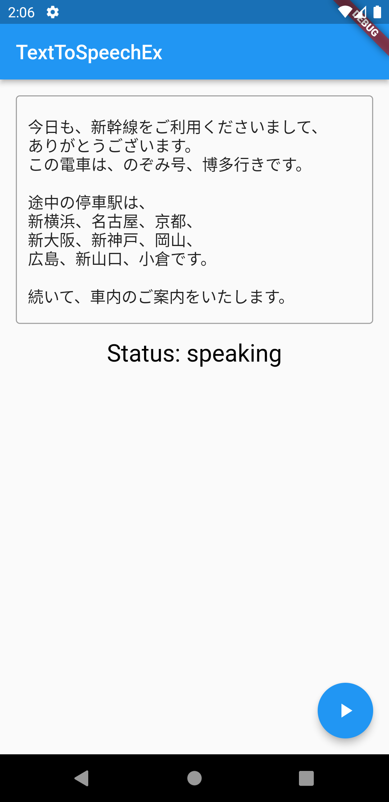

# text_to_speach_ex



## Requirements
- minSdkVersion 21
- テキスト読み上げを使用する場合、Android 11をターゲットとするアプリは、マニフェスト`INTENT_ACTION_TTS_SERVICE`の`queries`要素で次のように 宣言する必要があります。
    - 参考（公式）: https://developer.android.com/reference/android/speech/tts/TextToSpeech.Engine
```
<manifest>
　　・・・
    <queries>
　　　・・・
        <intent>
            <action android:name="android.intent.action.TTS_SERVICE" />
        </intent>
    </queries>
</manifest>
```

